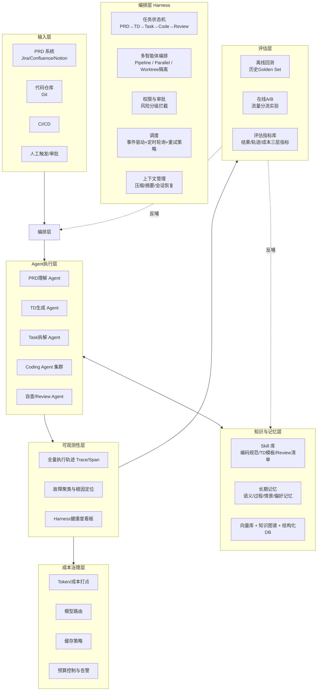
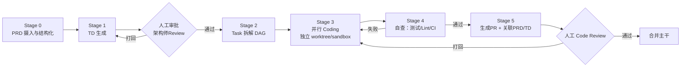
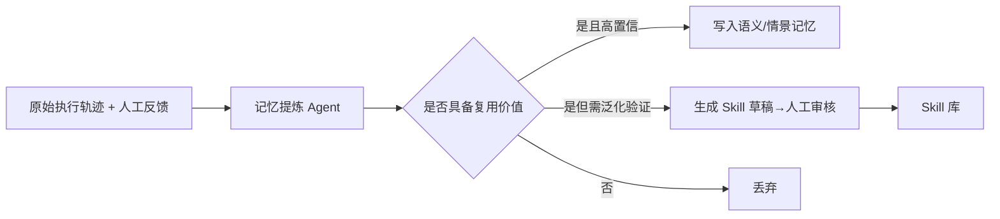
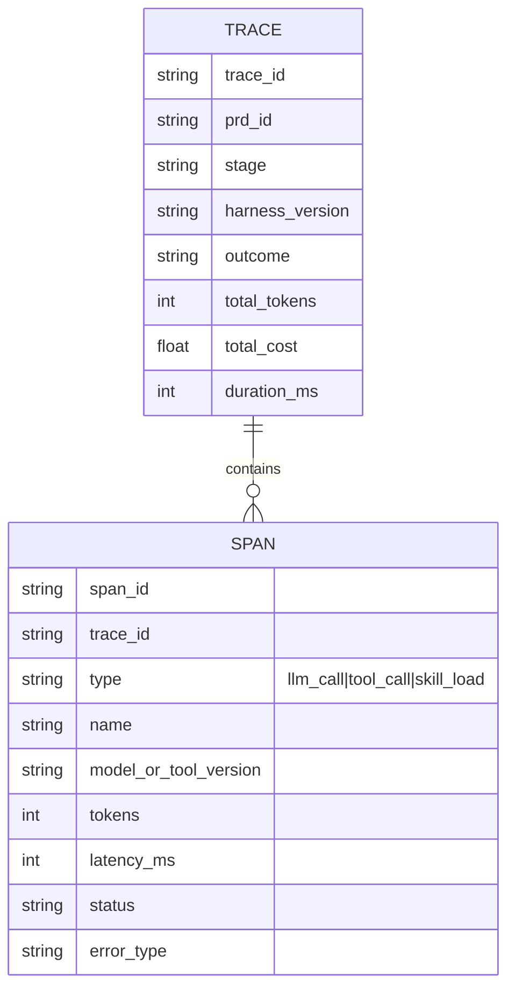
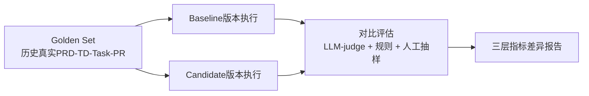
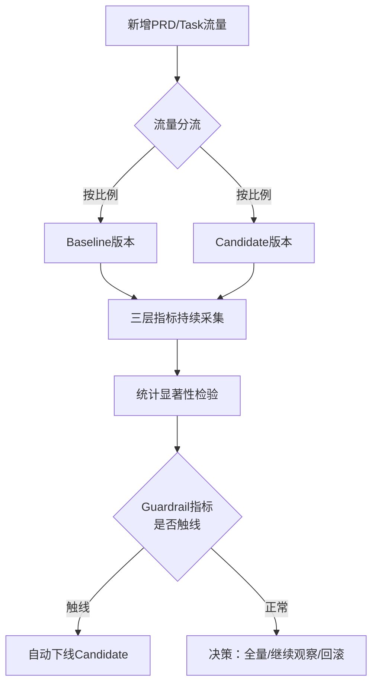

# AI Coding 工作流 Agent 系统架构设计
### PRD → TD → Coding Task 产研自动化平台

> 场景假设：面向内部研发团队，把「产品需求文档（PRD）→ 技术方案（TD）→ 编码任务（Coding Task）→ 代码产出」这条产研链路，用 Agent 系统自动化承接，同时具备可观测性（轨迹分析、故障定位）、评估体系（历史回测 + 在线 A/B）与成本治理能力。

---

## 0. 背景与问题定义

产研流程的自动化，本质上不是"让模型写代码"这一个点的问题，而是一整条**长周期、多阶段、人机协同**的流水线：

- PRD 到 TD 之间，隔着"业务理解 + 架构判断"；
- TD 到 Coding Task 之间，隔着"任务拆解 + 依赖排序"；
- Coding Task 到可合并代码之间，隔着"编码规范 + 测试验证 + Review"。

每一段都可能出错，而且出错的原因可能来自三个完全不同的层次——**模型本身推理不足**、**缺少合适的 Skill/知识**、或者**Harness（运行时）设计缺陷**（上下文丢失、工具编排错误、权限卡点缺失）。这也是本设计文档要解决的核心问题：

1. **产研自动化本身**：PRD-TD-Coding-Task 全链路怎么落地为 Agent 流水线；
2. **Harness / Skill / 长期记忆**：如何让 Agent 在长周期任务里保持上下文一致、可复用团队经验、持续进化；
3. **可观测性**：出了问题，怎么从海量执行轨迹里定位到"哪个 Harness 环节 / 哪个工具 / 哪个 Skill 版本"导致的；
4. **评估体系**：怎么科学衡量一次 Agent 变更（模型/Prompt/Skill/Harness 任一维度）是变好了还是变坏了——历史回测 + 在线 A/B；
5. **成本治理**：大规模跑 Agent 之后，token 成本怎么归因、怎么控制、怎么在质量红线之上做优化。

### 术语对齐

沿用团队内部已有的分层认知（详见 [Agent设计中的工具、技能与承载系统辨析.md](Agent设计中的工具、技能与承载系统辨析.md)），本设计中反复出现的三个概念：

| 层次 | 定义 | 在本系统中的角色 |
|---|---|---|
| **Tool** | 结构化、确定性执行的函数 | 读写代码、跑测试、调用 Jira/Git/CI API |
| **Skill** | 按需加载的自然语言知识/流程包 | 编码规范、TD 写作模板、Review checklist |
| **Harness** | 包裹在模型外层、决定 Agent 如何运转的运行时 | 编排、权限、上下文管理、调度、记忆持久化 |

本文新增第四个维度——**长期记忆（Memory）**：它不是 Harness 本身，而是 Harness 提供的一种能力，用于让 Agent 跨任务、跨会话地积累"这个代码库长什么样""上次这么做被打回过""团队更喜欢哪种实现"这类经验。

---

## 1. 总体架构

设计上的关键取舍：**可观测性层是全系统的地基**——没有全量、结构化的执行轨迹，评估体系无法量化对比，成本治理无法归因，故障定位只能靠猜。所以在实现顺序上，可观测性要早于评估体系、评估体系要早于大规模自动化上线。

---

## 2. 主链路：PRD → TD → Coding Task 流水线

### 2.1 阶段划分

每个阶段的具体设计：

| Stage | 输入 | 输出 | 关键能力 | 风险控制 |
|---|---|---|---|---|
| 0. PRD 摄入 | 原始 PRD 文档 | 结构化需求项（功能点/验收标准/优先级/依赖模块） | NLU 抽取 + Schema 校验 | 抽取置信度低于阈值转人工补全 |
| 1. TD 生成 | 结构化 PRD + 长期记忆（架构规范、历史 TD、API 目录） | 技术方案文档（方案选型/接口设计/数据变更/风险点） | RAG 检索代码库上下文 + Skill（TD 模板） | **强制人工审批关卡**，不允许 TD 直连自动合入 |
| 2. Task 拆解 | 已批准 TD | Coding Task DAG（每个 task 绑定文件范围/验收标准/依赖） | 任务粒度控制（避免过大/过细） | 拆解结果做依赖环检测 |
| 3. Coding | 单个 Coding Task | 代码 diff | 独立 worktree 隔离并行执行；Tool（读写代码/跑测试）+ Skill（编码规范） | 沙箱内执行，不触碰主干；单 task 超时/超预算自动熔断 |
| 4. 自查 | 代码 diff | 测试结果/Lint结果 | 自动跑 CI 子集 | 连续失败 N 次转人工，不无限重试 |
| 5. PR & 人工审批 | 通过自查的 diff | PR + 描述（自动关联 PRD/TD 链路） | 生成可追溯的血缘信息 | **合并主干必须人工审批**，Harness 层强制而非 Prompt 层"建议" |

> 为什么 TD 生成和最终合并这两个节点必须是硬性人工审批（Harness 权限系统拦截，而不是 Skill 里写"请询问用户"）：TD 涉及架构决策，代码合并涉及生产影响，这类不可逆或高影响操作，按照 Tool/Skill/Harness 的分层框架，属于**必须由 Harness 强制的风险边界**，写在提示词里的"建议"不能作为兜底。

### 2.2 编排范式选择

- Stage 3（并行 Coding）天然适合 **pipeline** 编排：不同 Task 各自独立流转，Task A 进入自查阶段时 Task B 可能还在编码，不需要互相等待（barrier）。
- Stage 1 的 TD 生成如果拆成"多维度并行起草 + 汇总"（比如性能方案 / 数据一致性方案 / 兼容性方案分别起草再合并），才需要 **parallel** 这种同步屏障。
- 默认原则：**没有跨 item 的强依赖就不要引入 barrier**，否则一个慢 Task 会拖慢整条流水线的吞吐。

---

## 3. Harness 设计

Harness 是本系统里"看不见但决定成败"的部分。核心能力清单：

### 3.1 执行隔离
- 每个 Coding Task 在独立的 git worktree / 容器沙箱中执行，避免多任务并行时互相污染文件状态；
- 沙箱内只暴露必要的 Tool（读写指定目录、跑测试、lint），越权操作在 Tool 层直接拒绝。

### 3.2 工具路由与权限分级
把所有 Tool 按风险分三级，权限系统按级别决定"自动执行 / 需要审批 / 禁止":

| 风险等级 | 示例操作 | 处理方式 |
|---|---|---|
| 低（只读/沙箱内可逆） | 读代码、跑单测、生成 TD 草稿 | 自动执行 |
| 中（沙箱内写、外部只读调用） | 在 worktree 内改代码、调用 Jira 只读 API | 自动执行 + 记录轨迹 |
| 高（不可逆/影响主干或外部系统） | 合并主干、发布、修改生产配置、发送外部通知 | **强制人工审批**，Harness 层拦截 |

### 3.3 会话与状态持久化
- 每条 PRD-TD-Task 生命周期视为一个可恢复的状态机：任一阶段中断（人工去 review TD 需要等待几小时/几天），系统应能在获得审批后从断点恢复，而不是重跑整条流水线；
- 类似"resume from run id"的机制——状态机快照 + 已完成阶段结果缓存，恢复时只重跑未完成部分。

### 3.4 调度
- 事件驱动为主（PRD 状态变更 webhook、CI 回调、审批通过事件），定时轮询为兜底；
- 失败重试策略分层：Tool 级瞬时错误（网络抖动）→ 指数回退重试；Agent 级逻辑失败（生成的代码测试不过）→ 有限次数重试后转人工；Harness 级系统性故障（某个外部 API 大面积失败）→ 触发降级/告警，而不是让每个任务各自傻等。

### 3.5 上下文管理
- 长 TD 文档、大型代码库上下文，需要压缩/摘要策略，防止上下文窗口溢出导致早期关键约束（比如 PRD 里的某条验收标准）被"遗忘"；
- 这类问题的正确修复位置是 Harness 的上下文管理策略，而不是"在 Skill 里反复提醒模型别忘了"。

---

## 4. Skill 体系设计

Skill 承载的是"团队怎么把事情做对"的方法论，随需加载、持续迭代：

| Skill | 用途 | 触发时机 |
|---|---|---|
| `td-writing-guide` | TD 文档结构模板、必须覆盖的章节（兼容性/回滚方案/监控埋点） | Stage 1 |
| `task-decomposition` | Task 拆解粒度原则（单任务不跨模块、不超过 N 个文件） | Stage 2 |
| `coding-convention-<lang/服务>` | 各语言/服务的编码风格、目录约定 | Stage 3，按代码所属服务动态匹配加载 |
| `code-review-checklist` | 自查/Review 维度（安全/性能/可测试性） | Stage 4/5 |
| `domain-guardrail-<业务线>` | 风控/合规相关编码红线 | 按 PRD 所属业务线加载 |

设计要点：
- **Skill 本身也是被评估的对象**——修改 `code-review-checklist` 后，PR 一次通过率有没有提升，需要走本文第 6 章的 A/B 机制，不能凭直觉改完就直接全量上线；
- Skill 的加载遵循渐进式披露：只在任务与 `description` 匹配时才拉入上下文，避免所有 Skill 常驻拖慢每次请求。

---

## 5. 长期记忆系统设计

### 5.1 记忆分类

| 记忆类型 | 内容 | 存储形态 | 典型用途 |
|---|---|---|---|
| **语义记忆** | 代码库架构、API 目录、历史架构决策记录（ADR） | 向量库 + 知识图谱 | TD 生成时检索"这个模块之前是怎么设计的" |
| **过程记忆** | 从大量执行轨迹中提炼出的经验规则 | 结构化规则库（人工审核后发布为 Skill） | "这类 Task 容易漏测某种边界情况" |
| **情景记忆** | 某次具体 PRD-TD-Task-PR 的完整历史 | 结构化 DB（血缘关系表） | 回答"这个函数为什么这么实现" |
| **偏好/反馈记忆** | 人工 Review 时给出的纠正意见 | 打标签的反馈条目 | 下次同类任务主动规避同样的问题 |

### 5.2 写入与提炼

记忆不是原始日志直接灌入，而是要经过"提炼"：

避免的反模式：直接把所有轨迹塞进向量库当记忆——这会导致检索噪声大、旧信息与代码库演进后的现状冲突。记忆需要**失效检测**（定期核对代码库是否仍与记忆描述一致）和**去重/泛化**。

### 5.3 读取

- 检索时机：每个 Stage 开始时，按当前任务的结构化上下文（涉及模块、业务线、历史相似 Task）做定向检索，而非全量加载——同样遵循渐进式披露原则；
- 检索结果需要做相关性过滤和条数上限控制，防止把上下文预算耗尽在低价值记忆上。

---

## 6. 可观测性与执行轨迹分析

这是回答"哪个 Harness 有问题"的核心机制。

### 6.1 数据模型

每次执行是一条 Trace，由多个 Span 组成（一次模型调用、一次工具调用、一次 Skill 加载各算一个 Span），并打上 `harness_version` / `skill_version` / `model_version` 三个版本标签——这是后续"根因定位"能落地的关键：没有版本标签，出问题只能凭感觉猜是哪次改动导致的。

### 6.2 根因定位方法

1. **按版本分组的指标对比**：把失败率、平均步骤数、平均耗时、平均成本按 `harness_version`/`skill_version`/`model_version` 分组统计，若某个版本上线后指标跳变，直接定位到具体变更；
2. **失败轨迹聚类**：对失败 Trace 做 embedding 后聚类，发现同类故障模式（例如都卡在同一个 Tool 调用、都在 TD 审批环节被打回同一类问题）；
3. **步骤级异常检测**：对每个 Stage 建立正常步骤数/重试次数的分布基线，某次执行显著偏离（如反复重试同一 Tool）自动标记异常，路由进人工复核队列，而不是等结果出来才发现问题；
4. **Harness 健康度指标**：工具调用成功率、平均重试次数、上下文压缩触发频率、权限拦截次数——这组指标直接反映的是运行时本身（而非模型能力）是否存在设计缺陷。这一点呼应 [Tool/Skill/Harness 辨析] 中的判断原则：如果问题集中在"编排/权限/上下文"维度，换模型是解决不了的，需要回到 Harness 设计本身。

### 6.3 数据规模与存储策略

- 近期（如 30 天）轨迹全量存储，支持任意维度下钻；
- 历史轨迹做摘要归档（保留统计特征和失败样本，丢弃完整 payload），控制存储成本；
- 敏感信息（代码内容、PRD 内部信息）在落盘前脱敏/加密，权限按团队隔离。

---

## 7. 评估体系：历史回测 + 在线 A/B

### 7.1 三层指标体系

评估任何一次变更（模型换版本、Prompt 调整、Skill 修改、Harness 编排逻辑调整），都从三层看：

| 层级 | 指标示例 | 目的 |
|---|---|---|
| **结果层** | PR 一次合并率、人工改动比例、上线后缺陷率、TD 一次审批通过率 | 最终业务价值是否变好 |
| **轨迹层** | 平均步骤数、工具调用次数、重试率、人工介入次数、是否走弯路 | 过程效率与稳定性，比"结果层"更早暴露问题 |
| **成本层** | token 消耗、模型调用次数、单任务成本、单位价值成本 | 质量提升是否是靠堆成本换来的 |

轨迹层指标的价值：结果层指标往往滞后（要等测试/人工review完成才知道好坏），轨迹层指标可以在过程中就发现"这个版本明显在某类任务上绕圈子"，更早预警。

### 7.2 离线回测（Offline Backtest）

- **Golden Set 维护**：从历史已合并的 PRD-TD-Task-PR 中筛选（要求最终被人工认可，作为 ground truth），按业务线/复杂度分层，避免样本偏向简单任务；
- **对比方式**：同一批输入，分别跑 baseline 和 candidate 版本，用 LLM-judge（结构化打分：方案完整性、代码正确性）+ 规则检查（测试是否通过、是否符合编码规范）+ 人工抽样复核（尤其 TD 质量这种主观性较强的维度）；
- **轨迹重放对比**：不只看最终产出，也对比达成同样结果所用的步骤数、工具调用路径是否更优——这是本系统区别于"只看输出对错"的传统评估的关键设计。

### 7.3 在线 A/B

- **分流维度**：可以是模型版本、Prompt 版本、Skill 版本、Harness 编排策略中的任意一个或组合，但**每次实验只变更一个维度**，否则无法归因；
- **分层抽样**：按项目复杂度、业务线分层分流，避免"candidate 恰好接到的都是简单任务"这类样本偏差；
- **Guardrail 机制**：设定质量红线（比如 PR 一次合并率不能低于 baseline 的 95%），一旦触线自动下线实验分支，防止把"降成本/提效率"的实验目标做成了牺牲质量——这是成本治理和质量保证之间的核心平衡机制；
- **样本量与实验周期**：产研类任务的天然流量比 C 端产品小得多，需要接受更长的实验周期或采用序贯检验（sequential testing）而非固定样本量的传统 A/B，避免"永远攒不够样本量"。

### 7.4 评估结果的反哺闭环

回测/A/B 中发现的失败模式，不应止步于一份报告，而要流回第 5 章的"记忆提炼"环节：固化为新的 Skill 规则或 Harness 编排调整，形成"执行 → 观测 → 评估 → 提炼 → 再执行"的闭环。

---

## 8. 成本治理

### 8.1 打点与归因

- 每个 Span 记录调用的模型、token 用量（输入/输出/缓存命中）、单价，汇总到 Trace 级和 PRD 级；
- 支持按团队/业务线/Stage 多维度成本归因报表——回答"这个月产研自动化花在哪了""哪个业务线的 TD 生成特别烧钱"。

### 8.2 模型路由

- 用一个轻量的"路由判断"前置步骤，按任务复杂度分发模型档位：结构化抽取、格式转换等用小模型；TD 架构设计、复杂 bug 定位等用大模型；
- 路由本身也要接受第 7 章的评估机制检验——路由策略调整属于典型的 A/B 实验对象（成本层指标会明显变化，需要同时盯结果层是否受损）。

### 8.3 缓存

- **Prompt caching**：长期记忆检索结果、Skill 内容、系统提示等重复片段走缓存；
- **结果缓存**：相同/高度相似的 TD 输入不重复生成；
- **渐进式披露**：Tool Schema 延迟加载、Skill 按需加载，本身就是从上下文经济学角度降低成本的手段（减少常驻 token）。

### 8.4 预算控制

- 单 PRD / 单 Task 设置成本上限，超限自动降级（换小模型、缩短检索范围）或转人工，而不是无限重试烧钱；
- 成本异常（某个 Trace 花费远超同类任务均值）纳入第 6 章的异常检测体系，而非只在月底账单上才发现。

---

## 9. 关键权衡与风险

| 风险 | 说明 | 缓解设计 |
|---|---|---|
| TD/合并环节过度自动化 | 架构决策和主干合并具有不可逆影响 | Harness 层强制人工审批，不依赖 Prompt 约定 |
| 长期记忆过时 | 代码库演进后旧记忆可能误导 Agent | 定期一致性校验，检索时带时效性权重 |
| 评估指标目标错配 | 只优化"测试通过率"可能导致 Agent 学会绕过测试而非正确实现 | 三层指标 + 人工抽样兜底，Guardrail 防止单一指标被 Game |
| 可观测性数据量爆炸 | 全量轨迹存储成本高 | 近期全量 + 历史摘要归档的分层存储 |
| A/B 样本量不足 | 产研任务流量远小于 C 端场景 | 序贯检验、分层抽样、延长观察窗口 |
| Skill/记忆无序增长 | 长期迭代后 Skill 库臃肿、记忆冲突 | Skill/记忆变更同样纳入评估流程，定期做去重/退役 |

---

## 10. 演进路线

| 阶段 | 目标 | 关键交付 |
|---|---|---|
| **M1 - MVP** | 单路径打通，人工全程在环 | PRD→TD→Task→Code 基础流水线，每步人工确认，基础日志 |
| **M2 - 知识化** | 引入 Skill 库 + 基础长期记忆 | RAG 检索代码库，TD/编码规范 Skill 上线 |
| **M3 - 可观测化** | 全量执行轨迹 + 离线回测 | Trace/Span 体系，Golden Set，版本对比报告 |
| **M4 - 实验化** | 在线 A/B 平台 + 成本治理自动化 | 流量分流框架、Guardrail 机制、成本归因报表 |
| **M5 - 自进化闭环** | 记忆自动提炼、Skill 自动生成草稿 | 提炼 Agent、评估反哺机制、人工审核后自动发布 |

---

## 附：面试可延伸讨论点

- 为什么 TD 生成和代码合并这两个节点必须是 Harness 强制审批，而不是靠 Skill/Prompt 提醒——权限边界的强制力来源问题。
- 轨迹层指标（步骤数、工具调用路径）相比结果层指标的领先指示意义——如何用过程信号更早发现 Agent 版本退化。
- A/B 实验中 Guardrail 机制如何防止"成本优化"和"质量保证"变成零和博弈。
- 长期记忆系统的"写入前提炼"设计，与直接把日志灌入向量库的方案相比，解决了哪些噪声和一致性问题。
- 如果要在有限工程资源下排出优先级，可观测性（M3）为什么应该早于大规模自动化上线，而不是等自动化做完再补可观测性。
